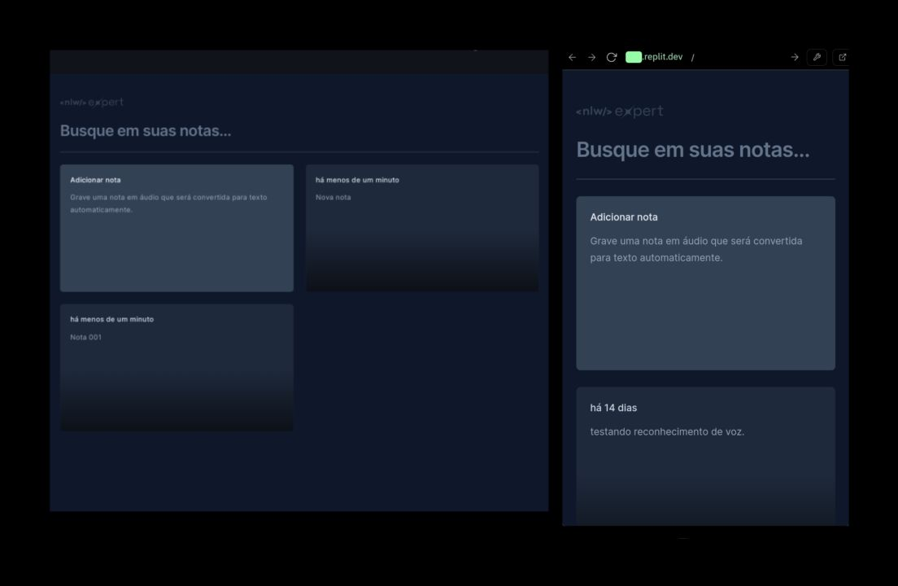

</img>

## Stack utilizada

**Front-end:** React, Typescript e Tailwindcss

# App de notas

Projeto desenvolvido durante o evento NLW experts da Rocketseat. Projeto consiste em uma aplicação de notas com reconhecimento de voz utilizando API's nativas do browser e salvando as notas no localstore.

API: SpeechRecognitionAPI

## Licença

[MIT](https://choosealicense.com/licenses/mit/)

## Referência

 - [Trilha React - NLW](https://github.com/rocketseat-education/nlw-expert-react)

